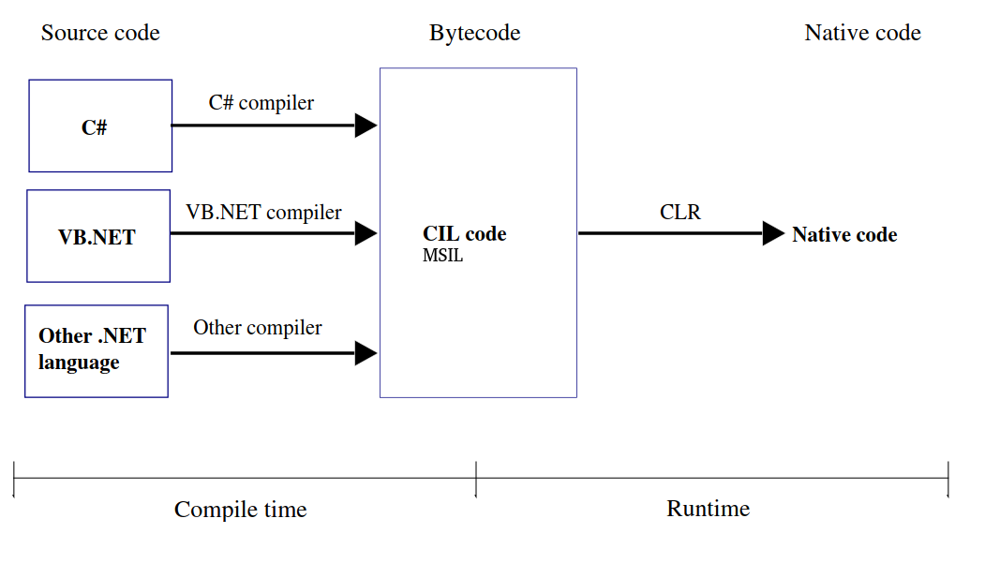
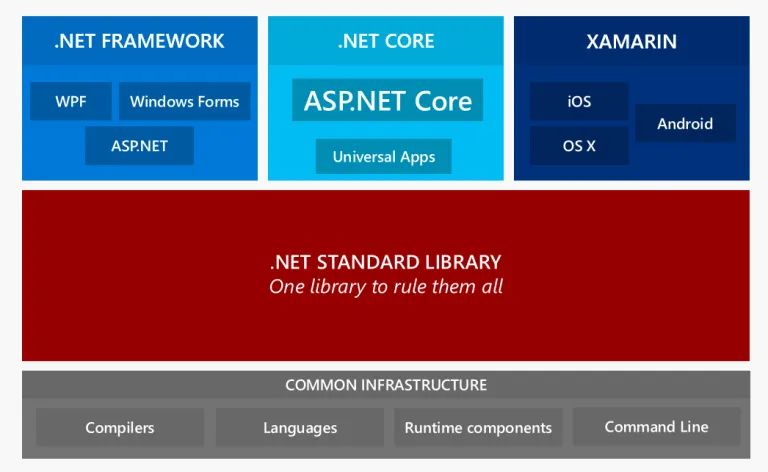
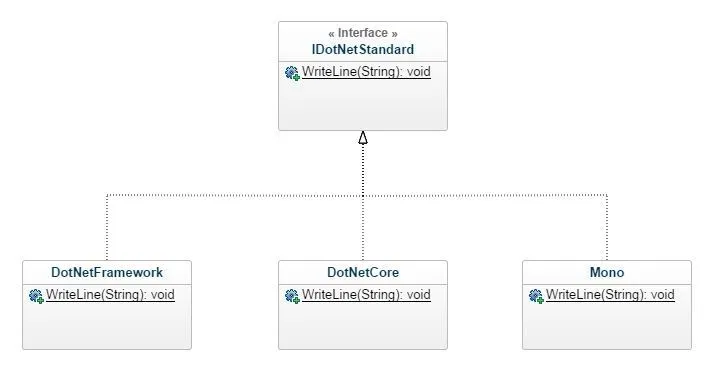
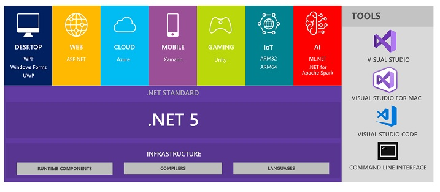

# Sobre
Estudo sobre o livro [C# 8.0 and .NET Core 3.0 – Modern Cross-Platform Development](https://www.amazon.com.br/8-0-NET-Core-3-0-Cross-Platform/dp/1788478126)

O objetivo é fazer um estudo amplo sobre o c# e .net core para atualizar e melhorar a desempenho no desenvolvimento, trabalho com .net c# desde 2013 e muita coisa surgiu, onde acabamos pegando as atualizações de forma picada, acabando não utilizando o que há de melhor na línguagem.

# Ambiente de desenvolvimento
Com o .net se tornando multiplataforma, resolvi realizar o estudo todo em um ambiente linux. Para quem sabe no futuro eu adote o Linux como plataforma definitiva.

## Máquina virtual
Para o estudo criei uma máquina virtual com a distribuição [Lubuntu](https://lubuntu.net/). Uma distribuição oficial da Ubuntu mais enxuta, sem muitos recursos, com as configurações abaixo a mesma está rodando sem travar:
- Memória: 1GB;
- Disco: 127GB;

## Softwares
### GIT
```sh 
apt-get install git 
```

### Visual Code
1 - Atualize o índice de pacotes e instale as dependências digitando:
```sh 
sudo apt update
sudo apt install software-properties-common apt-transport-https wget
```

2 - Em seguida, importe a chave Microsoft GPG usando o seguinte comando wget:
```sh
wget -q https://packages.microsoft.com/keys/microsoft.asc -O- | sudo apt-key add -
```

3 - E habilite o repositório do Visual Studio Code digitando:
```sh
sudo add-apt-repository "deb [arch=amd64] https://packages.microsoft.com/repos/vscode stable main"
```

4 - Assim que o repositório apt estiver habilitado, instale a versão mais recente do Visual Studio Code com:
```sh
sudo apt update
sudo apt install code
```

5 - Extensões

- C# for Visual Studio Code
(ms-vscode.csharp)

- C# XML Documentation
(k--kato.docomment Studio Code.)

- C# Extensions
(jchannon.csharpextensions)

- REST Client
(humao.rest-client)

- ILSpy .NET Decompiler
(icsharpcode.ilspy-vscode)

- SharpPad
(jmazouri.sharppad)


### .Net SDK
1 - A instalação com APT pode ser feita com alguns comandos. Antes de instalar o .NET, execute os comandos a seguir para adicionar a chave de assinatura do pacote da Microsoft à lista de chaves confiáveis e adicionar o repositório de pacotes:
```sh
wget https://packages.microsoft.com/config/ubuntu/20.04/packages-microsoft-prod.deb -O packages-microsoft-prod.debsudo apt install code

sudo dpkg -i packages-microsoft-prod.deb
```

2 - Instalar SDK:
```sh
sudo apt-get update; \
  sudo apt-get install -y apt-transport-https && \
  sudo apt-get update && \
  sudo apt-get install -y dotnet-sdk-3.1
```

### [Extra] Editor de imagem 
Com o intuito de realizar toda codificação no Linux para futuramente usar o mesmo como plaltaforma de trabalho, surgiu a necessidade de utilizar outras ferramentas. Uma foi um editor de imagem parecido com o Paint, para editar imagens que gostaria de incluir no README para que os exemplos. A ferramenta original que veio no SO (mtPaint) tive muita dificuldade e procurando uma ferramenta parecida com o MS Paint, encontrei o KolourPaint, e achei ela muito fácil de trabalhar.
```sh
sudo apt-get install kolourpaint 
```


# Entendendo o .Net
## Compilação
Quando uma aplicação .NET é compilada ela é convertida de sua linguagem escrita (Visual Basic .NET, C# ou outra compatível) para a Microsoft Intermediate Language (MSIL) ou Commom Itermediate Language (CIL). MSIL é uma linguagem de baixo-nível que a CLR (Common Language Runtime) pode ler e entender (executar).


 
A família .Net atualmente possui três plataformas:
- .Net Framework;
- .Net Core;
- Xamarim

Cada frente possui o seu próprio runtime, mas que seguem o principio da imagem acima de compilação.

Com o surgimento das novas plataformas, como a Microsoft define classes que são padrões em toda línguagem, não importando a plataforma Framework, Core ou Xamarim?

Ai que entra o .Net Standard.

## .Net Standard
"O .NET Standard é um conceito essencial para compreender a unificação das plataformas .NET sendo que atualmente podemos entender como 3 plataformas:"



"O .NET Standard é uma interface, uma espécie de contrato que define a lista de APIs que aquela determinada versão do .NET deve suportar. Para entender de forma muito simples o conceito do .NET Standard imagine o seguinte cenário:"



"Entenda que o .NET Standard é uma espécie de interface que define as APIs que cada versão do .NET irá oferecer suporte. O código do .NET Standard não possui implementação de comportamento, apenas a declaração das classes e métodos. Através deste padrão único conseguiremos uma total compatibilidade de um código .NET Framework para .NET Core por exemplo."

A explicação mais detalhada você encontra no ótimo artigo do Eduardo Pires: https://www.eduardopires.net.br/2017/06/net-standard-voce-precisa-conhecer/

## O futuro
Cada vez mais a Microsoft vem trabalhando para ter uma plataforma única de desenvolvimento. "Até o final de 2020, a Microsoft promete que haverá uma única plataforma .NET em vez de três. .NET 5.0 é planejado para ter um único BCL e dois tempos de execução: um
otimizado para cenários de servidor ou desktop, como sites e aplicativos de desktop do Windows
com base no tempo de execução do .NET Core e um otimizado para aplicativos móveis com base no
Tempo de execução do Xamarin."

Sairia deste desenho:


Para:


Assim teremos uma evolução continua e focada do .Net.
Maiores detalhes sobre o que será mantido, removido, cronograma de lançamento de uma olhada nesse artigo do Macoratti: http://www.macoratti.net/19/07/net5_net1.htm

# Comandos console .NET
```sh
# Lista informações do sdk e runtime instalados
dotnet --info 

# Lista os templates de projetos que podemos criar via console.
dotnet new -l 

# Cria um projeto to tipo console application
dotnet new console 
```

# Comandos linux
Novos comando linux que fui apredendo durante o estudo
```sh
# Listar arquivos em um diretório incluindo os ocultos
# Geralmente listava com o comando ls -l
ls -la
```

# C# o que aprendi durante o estudo
Vivendo e apredendo, eu gosto de estudar a teoria, para que possamos abstrair melhor o por que estamos utilizando um determinado recurso, sabendo os prós e contras (efeitos colaterias ou possíveis problemas que podem surgir no futuro), e não simplemente usar por que no Stack Overflow alguém indicou que naquele formato funciona. Assim teremos um horizonte amplo para solução de problemas. 

Como comecei a trabalhar com .Net/C# em 2013, não acompanhei a evolução do framework/línguagem, pois trabalhava com PHP. Vou anotar coisas que já existem a muito tempo na línguagem e nem tinha conhecimento da sua existencia. Além de revisões de alguns conceitos da computação.

## Float, Double e Decimal
Tipos que causam duvidas em muitas pessoas, qual tipo usar?

### Como o computador lida com esses tipos?
- Float e Double: São números representados internamente em base 2 (binário). Sendo números representados no formato binário os cálculos com esse tipo de número é realizado com uma velocidade bem maior que o decimal, isso por que o número já se encontra no formato que o hardware trabalha;
- Decimal: São números representandos internamento em base 10. O mesmo não possui um bom desempenho perante float/double, como ele é um número representado em base 10, é necessário um conversão para binário par que o cáculo sejá realizado;

Se float/double possuem um desempenho melhor, por que é recomendado usar decimal para cáculos financeiros?
- Devido a precisão. O número decimal é mais preciso perante float/double.

Vejamos uma exemplo do número 12,1 representado no formato float/double (binário):

|2^3|2^2|2^1|2^0|,|2^-1|2^-2|2^-3|2^-4|2^-5|2^3 |
|---|---|---|---|-|----|----|----|----|----|----|
| 8 | 4 | 2 | 1 |,|1/2 |1/4 |1/8 |1/16|1/32|1/64|
| 1 | 1 | 0 | 0 |,| 0  | 0  | 0  | 1  |    |    |

O número 12 basta colocarmos o bit 1 nas posições 8 e 4 (8+4 = 12);

Curiosidade: Por que após a vigula (parte fracionária) temos 2 elevado a -1 igual 1/2? Aqui temos dois principios matematicos:
- Dada uma potência x^–y, com x e y reais, o seu resultado é igual ao inverso de x elevado a y;
- Inverso: Dado um número qualquer, seu inverso é a fração cujo numerador é 1, e o denominador é o próprio número. Por exemplo, o inverso de 5 é 1/5, e o inverso de 10 é 1/10.
- Portanto 2^-1 é o inverso de 2 elevado a 1: (1/2)^1
- Portanto 2^-4 é o inverso de 2 elevado a 4: (1/2)^4 = (1/2 * 1/2 * 1/2 * 1/2) = 1/16

Para representar 0,1 em binário vamos dividindo as frações até achar o número mais próximo de 0,1:
- 1/2 = 0,5. Número maior que 0,1, próxima divisão;
- 1/4 = 0,25. Número maior que 0,1, próxima divisão;
- 1/8 = 0,125. Número maior que 0,1, próxima divisão;
- 1/16 = 0,0625. Número menor que 0,1, some esse valor as últimas posições marcadas com o bit 1 (0 + 0,0625 = 0,0625) e verifique se o valor retornado é menor ou igual 0,1.
- 1/32 = 0,03125. Número menor que 0,1, some esse valor as últimas posições marcadas com o bit 1 (0,0625 + 0,03125 = 0,09375) e verifique se o valor retornado é menor ou igual 0,1.
- 1/64 = 0,015625. Número menor que 0,1, some esse valor as últimas posições marcadas com o bit 1 (0,0625 + 0,03125 + 0,015625 = 0,109375) e verifique se o valor retornado é menor ou igual 0,1, neste caso é maior, não marque o bit 1 nessa posição e passe para a próxima posição.
- 1/128 = 0,015625. Número menor que 0,1, some esse valor as últimas posições marcadas com o bit 1 (0,0625 + 0,03125 + 0,015625 = 0,109375) e verifique se o valor retornado é menor ou igual 0,1, neste caso é maior, não marque o bit 1 nessa posição e passe para a próxima posição.

## Tipo dynamic
Introduzido no C#4 o tipo dinâmico define o tipo da várias em tempo de execução. Mas lógico que isso tem um custo computacional bem maior que um variável com o tipo estabelecido.

```csharp
dynamic anotherName = "Ahmed";
int length = anotherName.Length;
```

# Referências
- https://git-scm.com/download/linux
- https://linuxize.com/post/how-to-install-visual-studio-code-on-ubuntu-18-04/
- https://docs.microsoft.com/pt-br/dotnet/core/install/linux-ubuntu#2004-
- https://docs.microsoft.com/pt-br/archive/msdn-magazine/2017/september/net-standard-demystifying-net-core-and-net-standard
- http://www.macoratti.net/13/01/aspn_7cor1.htm
- https://www.eduardopires.net.br/2017/06/net-standard-voce-precisa-conhecer/
- https://juliobattisti.com.br/tutoriais/almirrivas/vbdotnet001.asp?imprime=sim
- https://mundoeducacao.uol.com.br/matematica/potencias-com-expoente-negativo.htm
